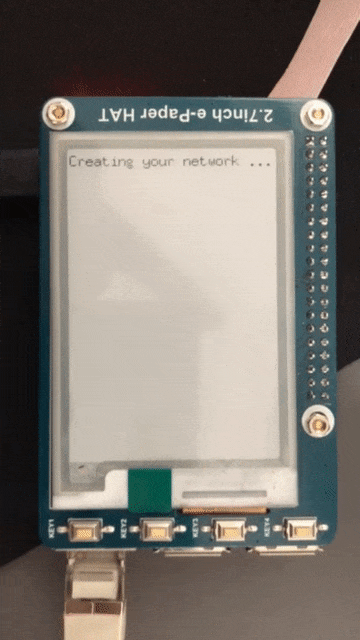
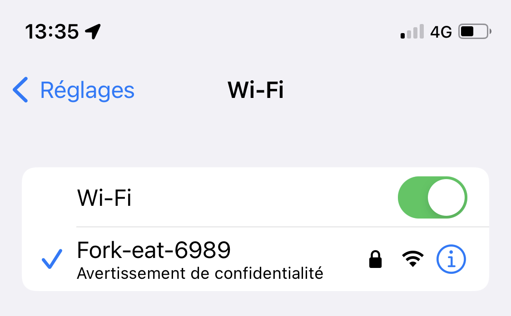
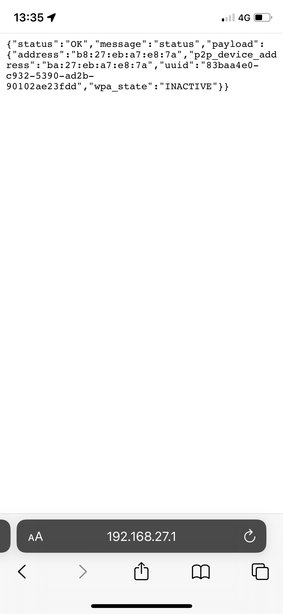

# embed-pi


## Installation setup


```sh

$ sudo apt install hostapd wireless-tools dnsmasq iw wpasupplicant
$ git clone https://github.com/ForkEat/embedpi.git
$ cd embedpi
$ sudo cp dev/configs/wpa_supplicant.conf /etc/wpa_supplicant/wpa_supplicant.conf
$ go build
$ pkill wpa_supplicant
$ sudo ./embed
```

## Developpement setup 


```sh
# Go install #
# Change pi password before or remove warning
$ git clone https://github.com/udhos/update-golang
$ cd update-golang
$ sudo ./update-golang.sh
$ nano /home/pi/.bashrc
> export GOROOT=/usr/local/go
> export GOPATH=$HOME/go
> export PATH=$GOPATH/bin:$GOROOT/bin:$PATH
$ source /home/pi/.bashrc
$ mkdir /home/pi/go && mkdir /home/pi/go/src

# Install zbar
$ sudo apt install libzbar0 zbar-tools libzbar-dev

# Txwifi requirements
$ sudo apt install dnsmaq iw wireless-tools hostapd 

# Install OpenCV
$ sudo nano /etc/dphys-swapfile
> CONF_SWAPSIZE=1024
$ sudo /etc/init.d/dphys-swapfile restart
$ sudo apt update
$ sudo apt install build-essential cmake git pkg-config libgtk-3-dev "libcanberra-gtk*"
$ sudo apt install libavcodec-dev libavformat-dev libswscale-dev libv4l-dev libxvidcore-dev libx264-dev
$ sudo apt install libjpeg-dev libpng-dev libtiff-dev gfortran openexr libatlas-base-dev opencl-headers libopencv-dev
$ sudo apt install python3-dev python3-numpy libtbb2 libtbb-dev libdc1394-22-dev
$ mkdir ~/opencv_build && cd ~/opencv_build
$ git clone https://github.com/opencv/opencv.git
$ git clone https://github.com/opencv/opencv_contrib.git
$ mkdir -p ~/opencv_build/opencv/build && cd ~/opencv_build/opencv/build
$ cmake -D CMAKE_BUILD_TYPE=RELEASE \ -D -DOPENCV_GENERATE_PKGCONFIG=ON -D CMAKE_INSTALL_PREFIX=/usr/local \ -D INSTALL_C_EXAMPLES=OFF \ -D INSTALL_PYTHON_EXAMPLES=OFF \ -D OPENCV_GENERATE_PKGCONFIG=ON \ -D ENABLE_NEON=ON \ -D OPENCV_EXTRA_EXE_LINKER_FLAGS=-latomic \ -D ENABLE_VFPV3=ON \ -D BUILD_TESTS=OFF \ -D OPENCV_ENABLE_NONFREE=ON \ -D OPENCV_EXTRA_MODULES_PATH=~/opencv_build/opencv_contrib/modules \ -D BUILD_EXAMPLES=OFF ..
$ make -j4
$ sudo make install
$ sudo pkg-config --cflags --libs opencv4

$ rm -rf ~/opencv_build
$ sudo nano /etc/dphys-swapfile
> CONF_SWAPSIZE=100
$ /etc/init.d/dphys-swapfile restart
```

### Connect to the Pi over Wifi

On your laptop or phone, you should now see a Wifi Network named **iot-wifi-cfg-3** assuming you did not change it from the default. The default password for this network is **iotwifipass**. Once connected to this network you should get an IP address assigned to the range specified in the config: `192.168.27.100,192.168.27.150,1h`.






Once connected open a web browser and go to http://192.168.27.1:8080/status. You can access this API endpoint on the Raspberry Pi device itself from `localhost`*. On on Pi try the curl command `curl http://localhost:8080/status`.

You should receive a JSON message similar to the following:

```json
{"status":"OK","message":"status","payload":{"address":"b8:27:eb:fe:c8:ab","uuid":"a736659a-ae85-5e03-9754-dd808ea0d7f2","wpa_state":"INACTIVE"}}
```

From now on I'll demonstrate API calls to the new container with the [`curl` command](https://en.wikipedia.org/wiki/CURL) on the device. If you were developing a Captive Portal or configuration web page, you could translate these calls into Javascript and control the device Wifi with AJAX.

> You can use my simple static web server IOT Web container for hosting a Captive Portal or configuration web page. See https://github.com/cjimti/iotweb.

To get a list of Wifi Networks the device can see, issue a call to the **scan** endpoint:

```bash
curl http://localhost:8080/scan
```

### Connect the Pi to a Wifi Network

The device can connect to any network it can see. After running a network scan  `curl http://localhost:8080/scan` you can choose a network and post the login credentials to IOT Web.

```bash
# post wifi credentials
$ curl -w "\n" -d '{"ssid":"home-network", "psk":"mystrongpassword"}' \
     -H "Content-Type: application/json" \
     -X POST localhost:8080/connect
```
You should get a JSON response message after a few seconds. If everything went well you will see something like the following:

```json
{"status":"OK","message":"Connection","payload":{"ssid":"straylight-g","state":"COMPLETED","ip":"","message":""}}
```

You can get the status at any time with the following call to the **status** endpoint. Here is an example:

```bash
# get the wifi status
$ curl -w "\n" http://localhost:8080/status
```

Sample return JSON:

```json
{"status":"OK","message":"status","payload":{"address":"b7:26:ab:fa:c9:a4","bssid":"50:3b:cb:c8:d3:cd","freq":"2437","group_cipher":"CCMP","id":"0","ip_address":"192.168.86.116","key_mgmt":"WPA2-PSK","mode":"station","p2p_device_address":"fa:27:eb:fe:c9:ab","pairwise_cipher":"CCMP","ssid":"straylight-g","uuid":"a736659a-ae85-5e03-9754-dd808ea0d7f2","wpa_state":"COMPLETED"}}
```

### Check the network interface status

The **wlan0** is now a client on a wifi network. In this case, it received the IP address 192.168.86.116. We can check the status of **wlan0** with `ifconfig`*

```bash
# check the status of wlan0 (wireless interface)
$ ifconfig wlan0
```

Example return.

```plain
wlan0: flags=4163<UP,BROADCAST,RUNNING,MULTICAST>  mtu 1500
        inet 192.168.86.116  netmask 255.255.255.0  broadcast 192.168.86.255
        inet6 fe80::9988:beab:290e:a6af  prefixlen 64  scopeid 0x20<link>
        ether b8:27:eb:fe:c8:ab  txqueuelen 1000  (Ethernet)
        RX packets 547  bytes 68641 (67.0 KiB)
        RX errors 0  dropped 0  overruns 0  frame 0
        TX packets 36  bytes 6025 (5.8 KiB)
        TX errors 0  dropped 0 overruns 0  carrier 0  collisions 0
```

We can also check the connection by issuing a **ping** command from the
device and specify the network interface to use:

```bash
# ping out from the wlan0 interface
$ ping -I wlan0 8.8.8.8
```

Hit Control-C to stop the ping and get calculations.

```plain
PING 8.8.8.8 (8.8.8.8) from 192.168.86.116 wlan0: 56(84) bytes of data.
64 bytes from 8.8.8.8: icmp_seq=1 ttl=57 time=20.9 ms
64 bytes from 8.8.8.8: icmp_seq=2 ttl=57 time=23.4 ms
64 bytes from 8.8.8.8: icmp_seq=3 ttl=57 time=16.0 ms
^C
--- 8.8.8.8 ping statistics ---
3 packets transmitted, 3 received, 0% packet loss, time 2002ms
rtt min/avg/max/mdev = 16.075/20.138/23.422/3.049 ms
```
